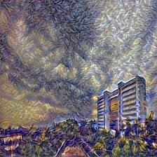

# Neural-Style-Transfer-VGG16
Neural style transfer using tensorflow 2

Ideas and some implementational details have been taken from [this](https://www.coursera.org/learn/convolutional-neural-networks) course.

Content Image:

Style image:

Result:

